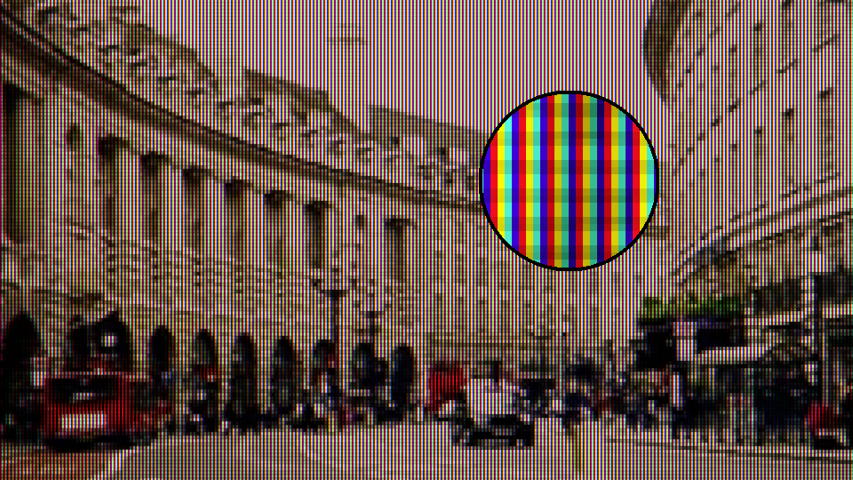
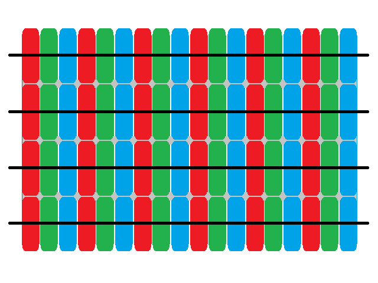
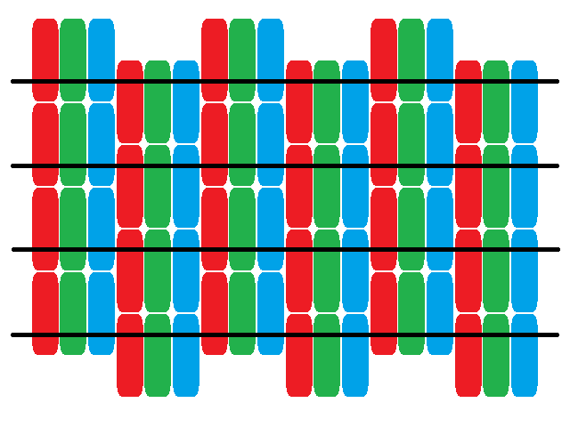
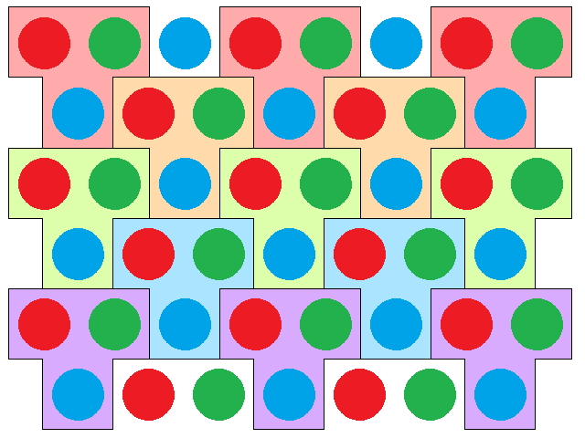
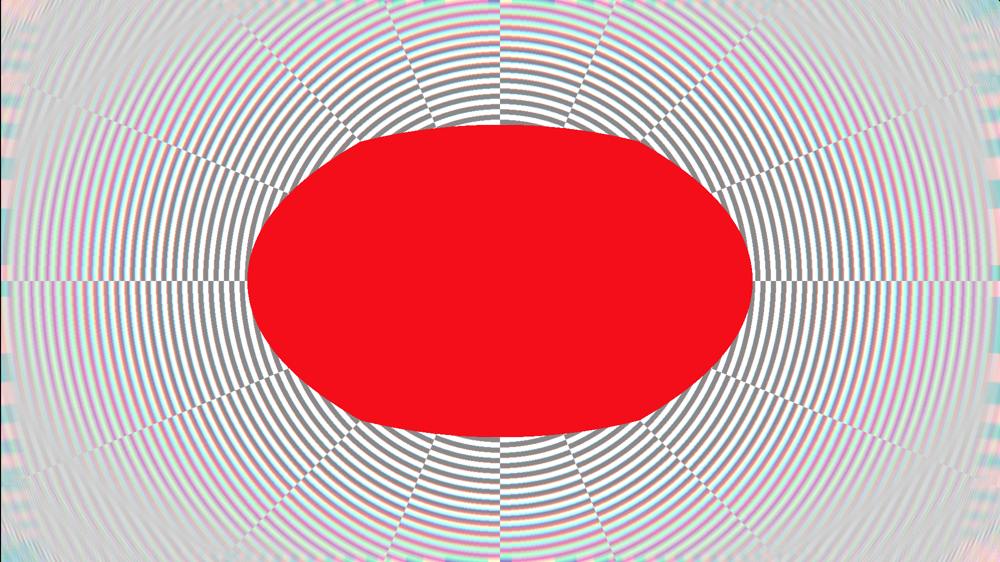
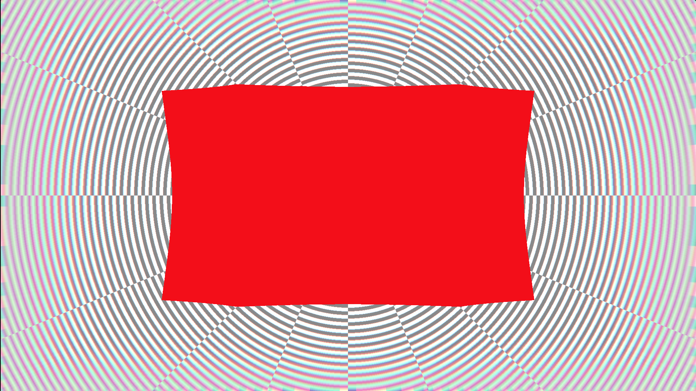

## 概要

ここでは，LCD モニタの出力映像に CRT モニタ特有の雰囲気を適用する方法について模索をする．



## はじめに

似たような課題の中，代表的なものは次のとおり．

1. 第 6 世代ゲーム機以前の映像を LCD モニタで再現  
   解像度間のピクセル 1:1 対応など，エミュレータ界隈の課題．

2. 空間内で CRT モニタを表現  
   一般的な現実感を追求する課題．

3. 出力映像に CRT モニタ特有の雰囲気を適用  
   1 番目の逆方向

3 番目が主目的となる．

## 理論と実践

### 基本機能

#### Mask

Mask とは，蛍光面と平行に配置された有孔の金属板. 電子銃から発射された電子線が，対応する蛍光体以外に当たらないよう陰をつくる. 類似する技術としては Shadow mask や Slot mask，Aperture grille があり，ここでは Mask と総称する．

[](https://commons.wikimedia.org/wiki/File:CRT_pixel_array.jpg "w:User:Planemad, CC BY-SA 2.5 <https://creativecommons.org/licenses/by-sa/2.5>, via Wikimedia Commons")

表現するにあたっては，Mask と蛍光面をまとめて扱う. 表現としての Mask は，実際の画面解像度に大きく影響を受ける. 実装は，FHD/4K/8K 毎に考慮する点に注意. 配列やテクスチャによる繰り返しパターンによる実装が一般的．

```glsl
// GLSL code
vec3 red     = vec3(1., 0., 0.);
vec3 blue    = vec3(0., 0., 1.);
vec3 yellow  = vec3(1., 1., 0.);
vec3 cyan    = vec3(0., 1., 1.);

// for Aperture grille
vec3 pattern[4] = vec3[](red, yellow, cyan, blue);

vec3 mask(in vec2 pos){
    int index = int(mod(pos.x, 4.));
    return pattern[index];
}
```

#### Pixelation

Mask を通り，蛍光体に照射される電子線を表現するには，ピクセル化が必要になる．また，代表値は考慮する余地があり，算術平均の他に幾何平均の利用なども考えられる．幾何平均は,

$$
\left(\prod_{i=1}^{n} a_{i} \right)^{\frac{1}{n}}
=\exp{\left(\frac{1}{n} \sum_{i=1}^{n} \ln{a_{i}}\right)}
$$

0 では未定義になるので，0 にも意味を持たせるように補正をすると,

$$
\left(\prod_{i=1}^{n} (a_{i}+1) \right)^{\frac{1}{n}} - 1
=\exp{\left(\frac{1}{n} \sum_{i=1}^{n} \ln{(a_{i}+1)}\right)} - 1
$$

形状については Ian Mallett 氏の[記事](https://geometrian.com/programming/reference/subpixelzoo/index.php) より,

> The most immediate concern is how the 2D square grid of the pixel data maps onto the non-square display. I haven't found anyone willing to say definitively what happens, but probably it's done by resampling, explicitly or implicitly—not by e.g. shifting alternate rows of the grid and squashing. Evidence in favor of this is the claim that CRT monitors are inherently multisync, and have no native resolution, as well as my own experiments on PenTile displays which showed that neighboring pixels can contribute to the same subpixel.

これは，正方形でのピクセル化が広く採用されている理由の一因かも知れない．

<div class="quarto-figure quarto-figure-center">
<figure class="figure">
<iframe src="https://www.shadertoy.com/embed/mtlfDs?gui=true&t=10&paused=true&muted=false" allowfullscreen></iframe>
<figcaption>Fig. 2a. 実装例 (resume で操作可/詳細はImageタグ)</figcaption>
</figure>
</div>

一方で，サイズと形状に焦点を当てると,

- Aperture grille  
  **原点が (0.5, 0.5) な [gl_FragCoord.xy](https://registry.khronos.org/OpenGL-Refpages/gl4/html/gl_FragCoord.xhtml)** を $\boldsymbol{p} \in \mathbb{R}^2$，ピクセル化サイズを $N \in \mathbb{N}$，変換後の座標を $\boldsymbol{q} \in \mathbb{R}^2$ とすると,

  $$
  \boldsymbol{q} = \boldsymbol{p} - (\lfloor \boldsymbol{p} \rfloor \bmod N)
  $$

- Slot mask  
  Aperture grille の定義に加え，$y_{offset} \in \mathbb{R}$ とすると,

  $$
  y_{offset}=
  \begin{cases}
    0 & \text{if $\lfloor\frac{p_{x}}{N}\rfloor$ even}\\
    \lfloor\frac{N}{2}\rfloor & \text{otherwise}
  \end{cases}
  $$

  この値を $p_{y}$ に減算代入し，Aperture grille の変換式を用いる．

- Shadow mask  
  図は，三つ組の同じ背景色が同じ行であることを示しており，T 形状が必要になることを示唆している．しかし，忠実に再現をすると解像度が水平方向は 3/2，垂直方向は 1/2 となるので，妥協が必要．







<div class="quarto-figure quarto-figure-center">
<figure class="figure">
<iframe src="https://www.shadertoy.com/embed/DldyzH?gui=true&t=10&paused=true&muted=false" allowfullscreen></iframe>
<figcaption>Fig. 2e. 妥協した結果</figcaption>
</figure>
</div>

表現すること自体は難しくないようだ．

<div class="quarto-figure quarto-figure-center">
<figure class="figure">
<iframe src="https://www.shadertoy.com/embed/DdcBzj?gui=true&t=10&paused=true&muted=false" allowfullscreen></iframe>
<figcaption>Fig. 2f. 実装例 (resume で操作可/詳細はImageタグ)</figcaption>
</figure>
</div>

#### Scanline

ある瞬間の電子銃は電子線を一点に発射している. Scanline とは，高速で動く電子銃が発射する電子線が蛍光体に当たった残光の軌跡により，画面上の一行と知覚される線のようなものである. これは遠目に見ても色線と黒線と認識ができる．

[](https://commons.wikimedia.org/wiki/File:Mitsubishi_CS-40307_CRT_Television_Close-up.jpg "Retro Tech, CC BY 3.0 <https://creativecommons.org/licenses/by/3.0>, via Wikimedia Commons")

これを表現するには，Shadow mask，Pixelation 同様に，サイズに応じた間隔での描画が必要になる．

TimothyLottes 氏の [FixingPixelArt](https://www.shadertoy.com/view/XsjSzR) で採用されているガウス関数を元にした実装では，水平方向と垂直方向で役割が異なる処理をしている．

<div class="quarto-figure quarto-figure-center">
<figure class="figure">
<iframe src="https://www.desmos.com/calculator/rj7a2xozbr?embed="></iframe>
<figcaption>Fig. 3a. 水平方向は軌跡を表現</figcaption>
</figure>
</div>

<div class="quarto-figure quarto-figure-center">
<figure class="figure">
<iframe src="https://www.desmos.com/calculator/4gtjci6rbo?embed="></iframe>
<figcaption>Fig. 3b. 垂直方向は色線と黒線を表現</figcaption>
</figure>
</div>

この垂直方向のガウス関数を使った方法は制御がし易く，自然な仕上がりになる．

また，周辺 3 行を対象にすることで，次のような効果も得ているようだ．

- 輝度の増幅  
  マスクを適用すると暗くなりがちなので有用. 電子線の軌跡のようなものと捉えるべきか?

- スキャンラインのアンチエイリアシング  
  歪曲収差を適用するとモアレが発生するので有用. 1次元の [Quincunx AA](https://www.researchgate.net/publication/221024360_New_Anti-Aliasing_and_Depth_of_Field_Techniques_for_Games_Graphics) のようなものか．

<div class="quarto-figure quarto-figure-center">
<figure class="figure">
<iframe src="https://www.shadertoy.com/embed/DsGyzR?gui=true&t=10&paused=true&muted=false" allowfullscreen></iframe>
<figcaption>Fig. 3c. 実装例 (resume で操作可/詳細はImageタグ)</figcaption>
</figure>
</div>

### 追加機能

#### Distortion

CRT モニタには，電子線の焦点の大きさが一定になるよう湾曲しているものとそうでないものがあり，広く知られているのは前者である．

[](https://commons.wikimedia.org/wiki/File:Cinescopio_per_televisore_a_schermo_rettangolare,_13_pollici,_deflessione_90%C2%B0,_bianco_e_nero_-_Museo_scienza_tecnologia_Milano_10082_dia.jpg 'Museo della Scienza e della Tecnologia "Leonardo da Vinci"
, CC BY-SA 4.0 <https://creativecommons.org/licenses/by-sa/4.0>, via Wikimedia Commons')

樽型の放射方向歪曲収差で表現する. Brown-Conrady モデル，または除算モデルを利用する．

$$
\begin{aligned}
x_u = x_c + \frac{x_d - x_c}{1 + K_1 r^2 + K_2 r^4 + \cdots}\\
y_u = y_c + \frac{y_d - y_c}{1 + K_1 r^2 + K_2 r^4 + \cdots}
\end{aligned}
$$

<div class="quarto-figure quarto-figure-center">
<figure class="figure">
<iframe src="https://www.desmos.com/calculator/ssop8renbo?embed="></iframe>
<figcaption>Fig. 4a. 除算モデルによるサンプリング</figcaption>
</figure>
</div>

<div class="quarto-figure quarto-figure-center">
<figure class="figure">
<iframe src="https://www.shadertoy.com/embed/Dd3cWs?gui=true&t=10&paused=true&muted=false" allowfullscreen></iframe>
<figcaption>Fig. 4b. 実装例 (resume で操作可/詳細はImageタグ)</figcaption>
</figure>
</div>

この処理で変換した座標を，異なる処理で使うと意図しない出力を得る可能性がある．

- テクスチャフェッチ  
  最近傍テクセルになるよう座標を調整することで回避可．

  $$
  \boldsymbol{q}_{d} = 0.5 + \lfloor \boldsymbol{p}_{d} \rfloor
  $$

- Mask  
  規則的なパターンが不規則となりモアレが発生する．ピクセル化サイズが十分小さいなら，変換した座標を使わないことも回避策のひとつ．

- Scanline  
  規則的なパターンが不規則となりモアレが発生する．目立たないよう消極的な回避策で妥協するかは課題となる．

<div class="quarto-figure quarto-figure-center">
<figure class="figure">
<iframe src="https://www.shadertoy.com/embed/DtccDM?gui=true&t=10&paused=true&muted=false" allowfullscreen></iframe>
<figcaption>Fig. 4c. 典型例</figcaption>
</figure>
</div>

#### Vignetting

周辺減光，あるいはケラレ．

[](https://commons.wikimedia.org/wiki/File:Swanson_tennis_center.jpg "Photograph taken from shifting pixel, photographer: Joe Lencioni (Jlencion at en.wikipedia)., CC BY-SA 2.5 <https://creativecommons.org/licenses/by-sa/2.5>, via Wikimedia Commons")

円や楕円では適用範囲が限定されるため，[超楕円](https://en.wikipedia.org/wiki/Superellipse)を利用する．

$$
\left|\frac{x}{a}\right|^n + \left|\frac{y}{b}\right|^n = 1
$$

形状としては，$a=b=1, \, n\ge 5$ が適当. ただし，冪演算を回避するため代替手段を採る．

$$
uv(1 - u)(1 -v) \quad (0\le u \le 1, \, 0\le v \le 1)
$$

<div class="quarto-figure quarto-figure-center">
<figure class="figure">
<iframe src="https://www.desmos.com/calculator/uds59cfch6?embed="></iframe>
<figcaption>Fig. 5a. Vignetting</figcaption>
</figure>
</div>

<div class="quarto-figure quarto-figure-center">
<figure class="figure">
<iframe src="https://www.shadertoy.com/embed/msdyDf?gui=true&t=10&paused=true&muted=false" allowfullscreen></iframe>
<figcaption>Fig. 5b. 実装例 (resume で操作可/詳細はImageタグ)</figcaption>
</figure>
</div>

#### Color fringing

Color fringing は色縁や色縞，あるいは色のずれを指し，各色の電子線が蛍光体上で意図しない位置を照射している場合に生じる現象．帯磁や劣化など原因は多岐にわたる．

[](https://commons.wikimedia.org/wiki/File:Degauss-in-progress_at_Dell-Trinitron-monitor.jpg "Nerd65536 at the English-language Wikipedia, Public domain, via Wikimedia Commons")

また，画面中央と周辺領域で蛍光体の面積が異なるような平面に近い CRT モニタでも生じる．

これを表現するには，光学系の倍率色収差を利用する．

<div class="quarto-figure quarto-figure-center">
<figure class="figure">
<iframe src="https://www.desmos.com/calculator/pxyvntbxnf?embed="></iframe>
<figcaption>Fig. 6a. 基本的なモデル</figcaption>
</figure>
</div>

基本的なモデルでは，全体に色のずれが発生している. ダメージを負った CRT モニタの表現としては良いかもしれないが，少々主張が激しい．Vignetting 同様に適用範囲を考えると，周辺領域に適用されるのが望ましい．

ここでは，Lesovoi 氏の[記事](https://habr.com/ru/companies/vk/articles/510330/)を参考に考察を行う．

- 物理ベース  
  必要性がないので除外

- 周辺領域への適用  
  [ユークリッド距離](https://en.wikipedia.org/wiki/Euclidean_distance)では円や楕円となり，中央領域への影響が未だ大きい．より周辺領域に寄せるため，[チェビシェフ距離](https://en.wikipedia.org/wiki/Chebyshev_distance)に置き換える．





<div class="quarto-figure quarto-figure-center">
<figure class="figure">
<iframe src="https://www.shadertoy.com/embed/ctsfz2?gui=true&t=10&paused=true&muted=false" allowfullscreen></iframe>
<figcaption>Fig. 6c. 実装例 (resume で操作可/詳細はImageタグ)</figcaption>
</figure>
</div>

### デモ

選択肢がある機能は次のとおり．

- Mask  
  すべて

- Pixelation  
  Model:4 の層化サンプリング下での算術平均

- Scanline  
  Model:2 のガウス関数

- Vignetting  
  Model:4 の超楕円の代替

- Color fringing  
  Model:4 のチェビシェフ距離による周辺領域への適用

通常，Mask や Scanline を導入した時点で画面が暗くなる．許容できない場合は，適当なガンマ補正やトーンマッピングを導入することになる．

<div class="quarto-figure quarto-figure-center">
<figure class="figure">
<iframe src="https://www.shadertoy.com/embed/mt3cDB?gui=true&t=10&paused=true&muted=false" allowfullscreen></iframe>
<figcaption>Fig. 7a. 実装例 (resume で操作可/詳細はImageタグ)</figcaption>
</figure>
</div>

## まとめ

各機能の選択に，これといった正解がないのが面白い課題．

## 参考文献

1. [New Anti-Aliasing and Depth of Field Techniques for Games Graphics.](https://www.researchgate.net/publication/221024360_New_Anti-Aliasing_and_Depth_of_Field_Techniques_for_Games_Graphics)

## 参考記事

1. [CRT shader masks - Filthy Pants: A Computer Blog](http://filthypants.blogspot.com/2020/02/crt-shader-masks.html)
2. [Subpixel Zoo - geometrian.com](https://geometrian.com/programming/reference/subpixelzoo/index.php)
3. [FixingPixelArt - shadertoy.com](https://www.shadertoy.com/view/XsjSzR)
4. [CRT shaders - emulation.gametechwiki.com](https://emulation.gametechwiki.com/index.php/CRT_shaders)
5. [Cathode-ray tube - en.wikipedia.org](https://en.wikipedia.org/wiki/Cathode-ray_tube)
6. [Shadow mask - en.wikipedia.org](https://en.wikipedia.org/wiki/Shadow_mask)
7. [Scan_line - en.wikipedia.org](https://en.wikipedia.org/wiki/Scan_line)
8. [Distortion (optics) - en.wikipedia.org](https://en.wikipedia.org/wiki/Distortion_(optics))
9. [Vignetting - en.wikipedia.org](https://en.wikipedia.org/wiki/Vignetting)
10. [Superellipse - en.wikipedia.org](https://en.wikipedia.org/wiki/Superellipse)
11. [Armored Warfare: Проект Армата. Хроматическая аберрация - lesha_lesovoy](https://habr.com/ru/companies/vk/articles/510330/)
12. [Euclidean distance - en.wikipedia.org](https://en.wikipedia.org/wiki/Euclidean_distance)
13. [Chebyshev distance - en.wikipedia.org](https://en.wikipedia.org/wiki/Chebyshev_distance)
