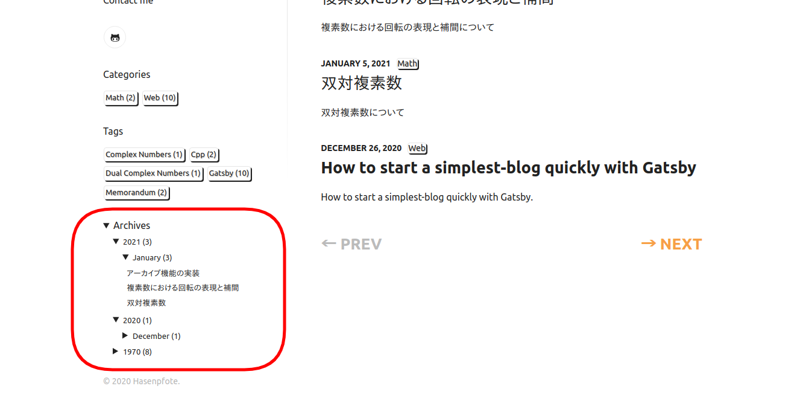

## 概要

下図のような機能を [gatsby-starter-lumen](https://github.com/alxshelepenok/gatsby-starter-lumen) へ実装することを目的とする．



大まかには次のようになる．

1. ページの生成
2. インターフェースの実装

## ページの生成

[gatsby-starter-lumen](https://github.com/alxshelepenok/gatsby-starter-lumen) への適用範囲．

```bash
.
├── gatsby
│   ├── create-pages.js
│   ├── on-create-node.js
│   └── pagination
│       └── create-archives-pages.js [New]
└── src
     ├── templates
     │    ├── monthly-archive-template.js [New]
     │    └── yearly-archive-template.js [New]
     └── types
          └── index.js
```

次のような形式で年・月別アーカイブページを生成する．

- 年別アーカイブ  
  `https://hasenpfote-old.netlify.app/archives/1970`
- 月別アーカイブ  
   `https://hasenpfote-old.netlify.app/archives/1970-1`

### GraphQL クエリ

標準のままでは良い絞り込み方法がないためキーを追加する．

- `fields___year`  
  年別アーカイブページ生成用
- `fields___year_month`  
  月別アーカイブページ生成用

追加方法は次のとおり．[^1]

[^1]: <https://github.com/gatsbyjs/gatsby/issues/27163>

**※以降，ファイル名の重複回避に"_"を"/"の代用として利用**

`gist:Hasenpfote/4413e4ec4685d320e0eb78c46781b5bd#gatsby_on-create-node.js?highlights=35-43`

**キーが反映されないことは多々あるが `gatsby clean` で解消できる．**

#### アーカイブページ生成用クエリ

追加したキーでグループ化をする．

`totalCount` には数量，`fieldValue` には年別なら4桁，月別なら1-2桁の数字が代入される．

```graphql
query MyQuery {
  yearly : allMarkdownRemark(
    filter: {frontmatter: {template: {eq: "post"}, draft: {ne: true}}}
  ) {
    group(field: fields___year) {
      totalCount
      fieldValue
    }
  }
  monthly : allMarkdownRemark(
    filter: {frontmatter: {template: {eq: "post"}, draft: {ne: true}}}
  ) {
    group(field: fields___year_month) {
      totalCount
      fieldValue
    }
  }
}
```

### 生成の流れ

ページクエリ用の変数を追加．

`gist:Hasenpfote/4413e4ec4685d320e0eb78c46781b5bd#src_types_index.js?lines=15-24&highlights=18`

ページ生成の共通部分．

`gist:Hasenpfote/4413e4ec4685d320e0eb78c46781b5bd#gatsby_pagination_create-archives-pages.js`

実際のページ生成部分はほぼ同等で冗長ではあるが分別しておく．

#### 年別アーカイブページ生成

`gist:Hasenpfote/4413e4ec4685d320e0eb78c46781b5bd#src_templates_yearly-archive-template.js`

#### 月別アーカイブページ生成

`gist:Hasenpfote/4413e4ec4685d320e0eb78c46781b5bd#src_templates_monthly-archive-template.js`

#### 呼び出し

`gist:Hasenpfote/4413e4ec4685d320e0eb78c46781b5bd#gatsby_create-pages.js?highlights=8,73`

## インターフェースの実装

[gatsby-starter-lumen](https://github.com/alxshelepenok/gatsby-starter-lumen) への適用範囲．

```bash
.
└── src
     ├── components
     │   └── Sidebar
     │        ├── ArchiveList [New]
     │        │   ├── ArchiveList.js [New]
     │        │   ├── ArchiveList.module.scss [New]
     │        │   └── index.js [New]
     │        └── Sidebar.js
     └── hooks
         ├── index.js
         └── use-archives-list.js [New]
```

### 下準備

年月のグループと年を取得する GraphQL クエリーを用意．

`gist:Hasenpfote/2c20f52b70307e4a3cd4669c07558215#src_hooks_use-archives-list.js`

`gist:Hasenpfote/2c20f52b70307e4a3cd4669c07558215#src_hooks_index.js?highlights=5`

### 実装

クエリだけでは済まなかった泥臭い部分．

`gist:Hasenpfote/2c20f52b70307e4a3cd4669c07558215#src_components_Sidebar_ArchiveList_ArchiveList.js`

`gist:Hasenpfote/2c20f52b70307e4a3cd4669c07558215#src_components_Sidebar_ArchiveList_ArchiveList.module.scss`

`gist:Hasenpfote/2c20f52b70307e4a3cd4669c07558215#src_components_Sidebar_ArchiveList_index.js`

### 呼び出し

サイドバーからの呼び出し部分．

`gist:Hasenpfote/2c20f52b70307e4a3cd4669c07558215#src_components_Sidebar_Sidebar.js?highlights=7,28`
