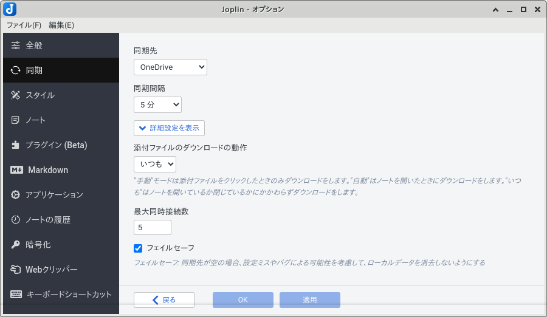
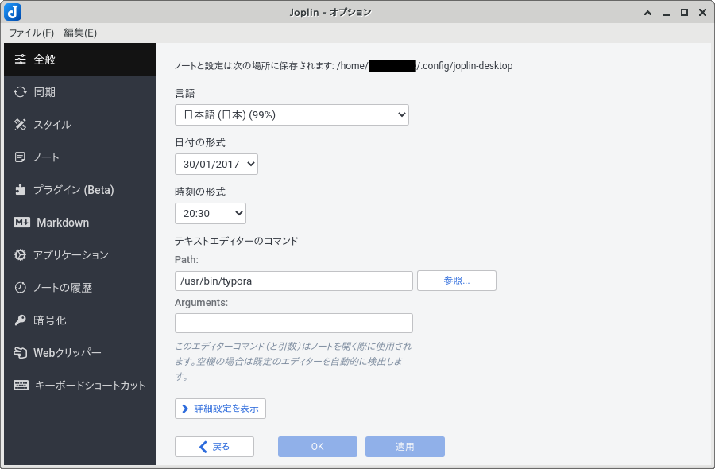

## 概要

クロスプラットフォームな Markdown 統合環境 [Joplin](https://joplinapp.org) の運用方法について．

```{mermaid}
graph TD
  subgraph Cloud
    A[(Joplin)]
  end
  subgraph Desktop
    B[(Joplin)]
  end
  subgraph Laptop
    C[(Joplin)]
  end
  subgraph Mobile
    D[(Joplin)]
  end
  subgraph e[Other]
    E[(Joplin)]
  end
  B & C & D & E ---|Sync| A
```

管理方法の差異に拘りがなければ [Typora](https://typora.io) で完結することも可能．

```{mermaid}
graph LR
  subgraph Terminal
    A[Typora] --- B[(Storage)]
  end
  subgraph Cloud
    C[(Storage)]
  end
  B ---|Own Sync| C
```

## 設定

動作確認は Linux Mint 19.3 Tricia で行った．

### クラウドサービスと同期

実質  [OneDrive](https://www.microsoft.com/ja-jp/microsoft-365/onedrive/online-cloud-storage) 一択で流れに沿って登録するだけで済む．

**フェイルセーフのチェックを外すと絶望のどん底に突き落とされるので要注意．**



### 外部エディタとの連携

[Joplin](https://joplinapp.org) のまま編集をすることもできるが没入感を阻害されるので外部エディタとの連携を行う．



## ブラウザ

オプション機能としては Chromium 派生ブラウザなら [Joplin Web Clipper](https://chrome.google.com/webstore/detail/joplin-web-clipper/alofnhikmmkdbbbgpnglcpdollgjjfek) ．モバイル版は URL の保存しかできないので役に立たない．

## モバイル

Android なら公式の [Joplin](https://play.google.com/store/apps/details?id=net.cozic.joplin) ．読み込み専用にすることで閲覧目的に利用すると使い勝手が良い．