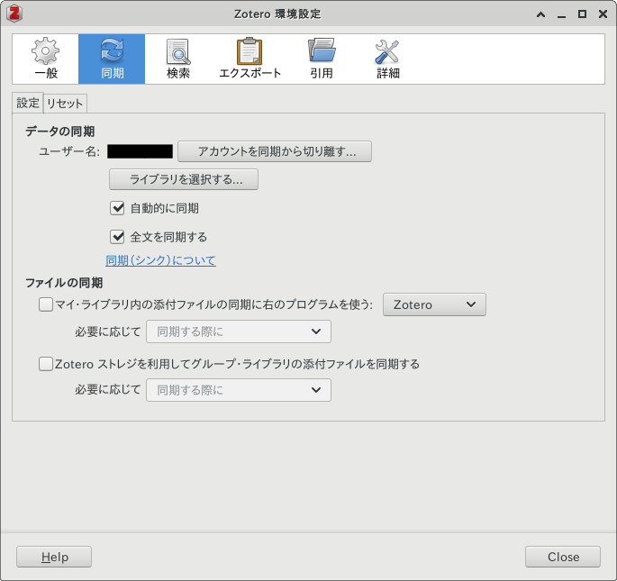
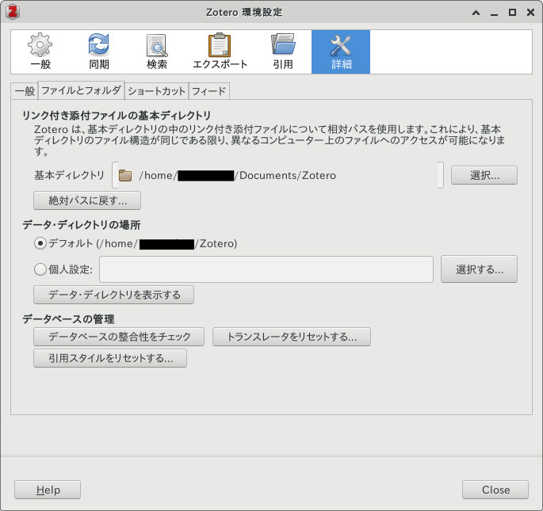

## 概要

クロスプラットフォームな文献管理ソフトウェア [Zotero](https://www.zotero.org) の運用方法について．

方針は

- Zotero DB は [Zotero Stotage](https://www.zotero.org/storage) と同期
- 文献(PDF など)は他クラウドサービスと同期

```{mermaid}
graph TD
  subgraph Zotero
    A[(Zotero)]
  end
  subgraph Cloud
    B[(Storage)]
  end
  subgraph Desktop
    C[(Zotero)]
  end
  subgraph Laptop
    D[(Zotero)]
  end
  subgraph Mobile
    E[(Zotero)]
  end
  subgraph Other
    F[(Zotero)]
  end
  A ---|Zotero Sync| C & D & E & F ---|Own Sync| B
```

分離する理由は

- フリープランは 300Mの制限
- リスクマネジメント(最低でも文献が読めれば良い)

## 設定

動作確認は Linux Mint 19.3 Tricia で行った．

### Zotero DB を Zotero Storage と同期

```{mermaid}
graph LR
  subgraph Zotero
    A[(Zotero)]
  end
  subgraph Terminal
    B[(Zotero)]
  end
  B ---|Zotero Sync| A
```

- Zotero アカウントを設定
- ファイルの同期にはチェックをしない



### 文献を他クラウドサービスと同期

```{mermaid}
graph LR
  subgraph Cloud
    A[(Storage)]
  end
  subgraph Terminal
    B[(Storage)]
  end
  B ---|Own Sync| A
```

ここでは文献の置き場所を分離し，独自の同期を行うことを想定する．



## クラウドサービスと同期

フリー前提で宗教上の特段の理由でもない限り [OneDrive](https://www.microsoft.com/ja-jp/microsoft-365/onedrive/online-cloud-storage) がバランス良．Linux では公式クライアントがないので [OneDrive Client for Linux](https://github.com/abraunegg/onedrive) で代替．

## ブラウザ

Chromium 派生ブラウザなら [Zotero Connector](https://chrome.google.com/webstore/detail/zotero-connector/ekhagklcjbdpajgpjgmbionohlpdbjgc) ．
ブラウジング時に文献を Zotero に放り込んでくれる．

## モバイル

Android なら [ZotEZ²](https://play.google.com/store/apps/details?id=net.ezbio.zotez2&hl=ja&gl=US) 一択．Zotero DB と同期を行い，ユーザがクリックした時だけ文献をDLする仕組みにできる．
